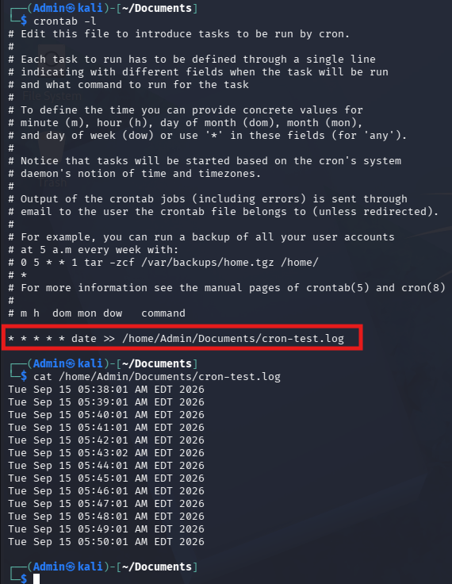

# Cron va Crontab — tushuntirish

## 🎯 Nima uchun kerak?

Tizim yoqilgandan keyin (yoki muntazam ravishda) avtomatik bajariladigan vazifalarni sozlash uchun. Masalan: fayllarni backup qilish, dasturlarni ishga tushirish, buyruqlarni jadval bo'yicha bajarish.

## ⚙️ Cron nima?

**Cron** — bu tizim yuklanganda ishga tushadigan process (background'da doim ishlaydi). U **crontab** fayllarini o'qib, unda yozilgan vazifalarni belgilangan vaqtda bajaradi.

**Crontab** — cron uchun maxsus formatdagi fayl, har bir qator alohida vazifa.

## 📋 6 ta asosiy qiymat

| Qiymat | Nima uchun |
|--------|-----------|
| MIN | Necha minutda ishga tushsin |
| HOUR | Necha soatda |
| DOM | Oyning qaysi kunida (Day of Month) |
| MON | Yilning qaysi oyida |
| DOW | Haftaning qaysi kunida (Day of Week) |
| CMD | Bajariladigan buyruqning o'zi |

## 💡 Misol

Har 12 soatda `cmnatic` foydalanuvchisining `Documents` papkasini backup qilish uchun quyidagi qator yoziladi:

```bash
0 */12 * * * cp -R /home/cmnatic/Documents /var/backups/
```

**Izoh:**
- `0` — 0-minutda
- `*/12` — har 12 soatda bir marta
- `* * *` — oy, kun, hafta kuni muhim emas (wildcard)
- oxiri — bajariladigan buyruq

## ⭐ Wildcard (`*`) nima uchun?

Agar biror qiymat muhim bo'lmasa (masalan, "qaysi oy" farqi yo'q), o'sha joyga `*` qo'yiladi — "istalgan vaqt/qiymat" degani.

## 🛠️ Foydali resurslar
- **Crontab Generator** — vizual interfeys orqali formatlashni avtomatik yaratadi
- **Cron Guru** — sintaksisni tekshirish/tushuntirish uchun

## 📝 Tahrirlash

```bash
crontab -e
```
Bu buyruq crontab faylini ochadi (odatda Nano editor bilan), o'zgarishlar shu yerda kiritiladi.

## Task 1 — Automation (Amaliy mashq)

Cron qanday ishlashini tushunish uchun eng yaxshi yo'l — uni amalda sinab ko'rish. Quyidagi qadamlarni ketma-ket bajaring:

**1-qadam:** Crontab editorni oching:
```bash
crontab -e
```

**2-qadam:** Quyidagi qatorni qo'shing — bu har daqiqada joriy vaqtni faylga yozadi:
```bash
* * * * * date >> /home/Admin/Documents/cron-test.log
```

**3-qadam:** Saqlab chiqing (`Ctrl+O` → `Enter` → `Ctrl+X`), so'ng tekshiring:
```bash
crontab -l
```

**4-qadam:** Bir necha daqiqa kutib, natijani ko'ring:
```bash
cat /home/Admin/Documents/cron-test.log
```

Agar hammasi to'g'ri ishlagan bo'lsa, quyidagidek natija chiqadi — har daqiqada aniq bitta yangi qator qo'shilib boradi:



### Qo'shimcha mashq: turli vaqt formatlarini sinab ko'ring

Cron formatini yaxshiroq o'zlashtirish uchun quyidagi misollarni ham o'zingiz yozib ko'ring:

- `0 */12 * * *` — har 12 soatda ishga tushadi
- `45 23 1,15 2,4,6,8,10,12 *` — oyning 1- va 15-kunlarida, belgilangan oylarda (fevral, aprel, iyun, avgust, oktyabr, dekabr), soat 23:45da ishga tushadi
- `0 8 * * 1,3,5` — dushanba, chorshanba va juma kunlari soat 8:00da ishga tushadi

Har birini `crontab -e` orqali kiritib, `crontab -l` bilan tekshirib boring — shu tariqa format qanday o'zgarishini his qilasiz.

## Package Management

## 📦 Packages va Software Repos nima?

Dasturchilar dasturiy ta'minotni jamiyat bilan ulashmoqchi bo'lganda, ular **"apt" repository**siga topshiradi. Agar tasdiqlansa, dastur/tool ommaga chiqariladi. Bu yerda Linux'ning ikkita muhim afzalligi ko'rinadi: **foydalanuvchi qulayligi** va **ochiq manba (open source) dasturlarning qiymati**.

Ubuntu 20.04'da `ls` buyrug'ini repository ro'yxati fayllariga qo'llasangiz, bu fayllar tizim uchun **"darvoza/registr"** vazifasini bajaradi.

Operatsion tizim ishlab chiqaruvchilari o'z repository'larini saqlab turadi, lekin foydalanuvchi sifatida siz ham **jamiyat (community) repository'larini** qo'shishingiz mumkin! Bu OS imkoniyatlarini kengaytiradi. Qo'shimcha repository'lar `add-apt-repository` buyrug'i orqali yoki boshqa provayderni ro'yxatga kiritish orqali qo'shiladi (masalan, ba'zi vendorlar geografik jihatdan yaqinroq repository'ga ega bo'ladi).

## ⚙️ Repository'larni boshqarish (qo'shish va o'chirish)

Odatda dastur o'rnatish uchun **`apt`** buyrug'idan foydalaniladi. `apt` — bu paket boshqaruv dasturining bir qismi bo'lib, u paketlar va manbalarni (sources) boshqarish, dastur o'rnatish yoki o'chirish imkonini beradi.

Repository qo'shishning bir usuli — `add-apt-repository` buyrug'i, lekin buni **qo'lda** ham bajarish mumkin. `dpkg` kabi paket o'rnatuvchilar orqali ham dastur o'rnatish mumkin, lekin `apt`ning afzalligi shundaki — tizim yangilanganda, qo'shilgan repository'dagi dasturlar ham avtomatik tekshiriladi.

### 🔐 GPG kalitlari nima uchun kerak?

Dastur qo'shilganda, yuklab olinayotgan narsaning haqiqiyligi **GPG (Gnu Privacy Guard)** kalitlari orqali kafolatlanadi. Bu kalitlar — ishlab chiqaruvchilardan kelgan "bu bizning dasturimiz" degan xavfsizlik tasdig'i. Agar kalit tizim ishongan narsaga mos kelmasa, dastur yuklab olinmaydi.

## 🛠️ Misol: Sublime Text repository qo'shish (nazariy)

Sublime Text — standart Ubuntu repository'sida yo'q, shuning uchun uni qo'lda repository sifatida qo'shish kerak bo'ladi.

**1-qadam:** GPG kalitini yuklab, ishonchli deb belgilash:
```bash
wget -qO - https://download.sublimetext.com/sublimehq-pub.gpg | sudo apt-key add -
```

**2-qadam:** Repository faylini yaratish. Yaxshi amaliyot — har bir 3rd-party repository uchun alohida fayl yaratish. `/etc/apt/sources.list.d/` papkasida `sublime-text.list` nomli fayl yaratiladi va ichiga repository manzili kiritiladi (Nano yoki boshqa matn muharriri orqali).

**3-qadam:** Yangi manbani tizimga tanitish uchun `apt update` ishlatiladi:
```bash
sudo apt update
```

**4-qadam:** Dasturni o'rnatish:
```bash
sudo apt install sublime-text
```

## 🗑️ Paketni olib tashlash

O'chirish — qo'shishning teskarisi. Ikki usul bor:
- `add-apt-repository --remove ppa:PPA_Name/ppa` buyrug'i orqali
- Yoki qo'shilgan faylni qo'lda o'chirish orqali

Repository o'chirilgach, dasturning o'zini olib tashlash uchun:
```bash
sudo apt remove sublime-text
```

## Logs

## 📜 Log fayllari nima?

Log fayllar **`/var/log`** papkasida joylashgan. Bu fayllar va papkalar tizimda ishlayotgan dasturlar va servislar haqidagi **logging (qayd qilish) ma'lumotlarini** o'z ichiga oladi. Operatsion tizim (OS) bu loglarni avtomatik boshqarishda ancha yaxshi rivojlangan — bu jarayon **"rotating" (aylantirish)** deb ataladi.

## 🖥️ Uchta xizmat misolida loglar

Ubuntu mashinasida ishlaydigan uchta xizmatning loglariga misol:

1. **Apache2 web server** — veb-server loglari
2. **fail2ban** xizmati — brute-force (parolni zo'rlab topish) urinishlarini kuzatish uchun ishlatiladi
3. **UFW** xizmati — firewall (xavfsizlik devori) sifatida ishlatiladi

## 🛡️ Nega bu loglar muhim?

Bu xizmatlar va ularning loglari — tizim **sog'lig'ini kuzatish va himoya qilish** uchun ajoyib vosita. Bundan tashqari, veb-server kabi xizmatlarning loglari **har bir so'rov (request)** haqida ma'lumot saqlaydi — bu dasturchi yoki administratorga **ishlash muammolarini aniqlash** yoki **buzg'unchi (intruder) faoliyatini tekshirish** imkonini beradi.

Masalan, ikki turdagi muhim log fayllari:
- **access log** — kim, qachon, qanday so'rov yuborganini yozadi
- **error log** — xatoliklar haqida ma'lumot saqlaydi

## 👤 OS va foydalanuvchi loglari

Bulardan tashqari, operatsion tizimning o'zi qanday ishlayotgani va foydalanuvchilar tomonidan bajarilgan amallar (masalan, **autentifikatsiya urinishlari**) haqida ma'lumot saqlaydigan loglar ham mavjud.

